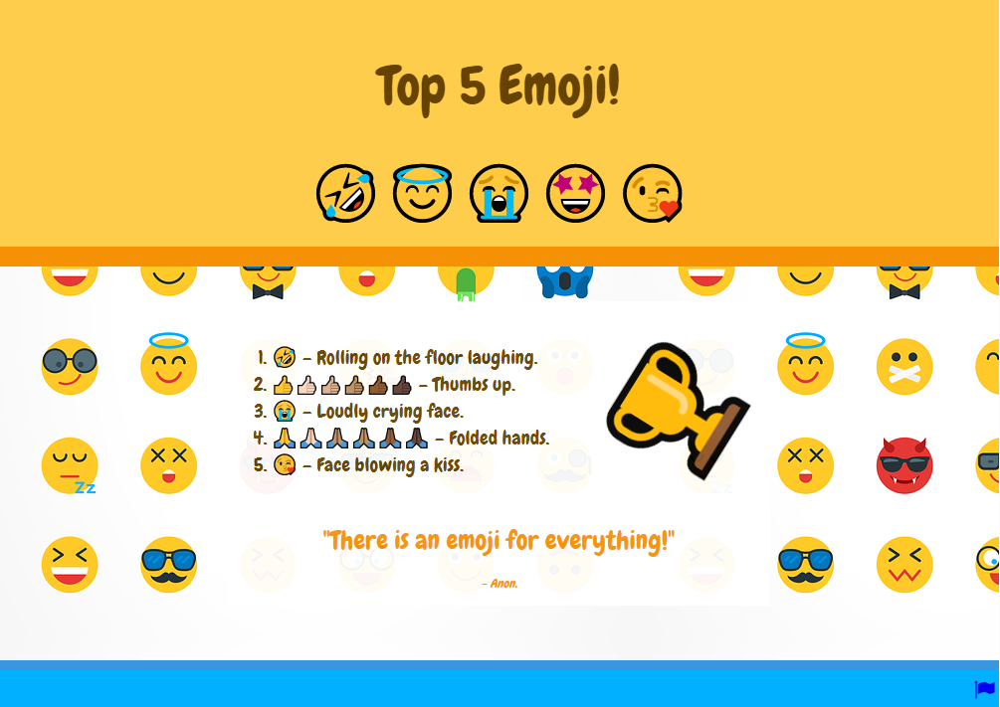

## Introduction

In this project, you will create a top 5 list of emojis with animated emojis and an emoji background.

CSS animations are used to grab people's attention and make a website engaging without slowing down the loading of pages. The animations work by changing one or more properties of an element over a period of time. Examples of animations are hover effects, loading images, text animation, particle effects, and animated images.

You will:
+ Use **lists**, **block quotes**, and **links** in HTML
+ Use CSS **animations** to make your page attract people's attention
+ Create your own **CSS class** that makes elements transparent so you can see a background image

A **content writer** or content author researches and writes interesting articles for a website. Top 5 or 10 lists are popular with lots of people. What would you make a list about?

--- no-print --- --- task ---
### Try it

  
Watch the animations on this webpage. How often do they repeat? Can you spot a:

+ List
+ Quote
+ Link

**Tip:** Press the Run button to play the animations again.

<iframe src="https://trinket.io/embed/html/092b44465f?outputOnly=true" width="500" height="600" frameborder="0" marginwidth="0" marginheight="0" allowfullscreen></iframe>

--- /task --- --- /no-print ---

--- print-only ---  --- /print-only ---
