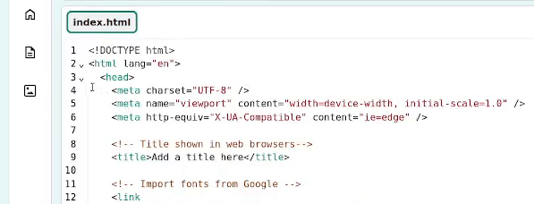

## Create a top 5 list

In this step, create a top 5 ordered list to show the most used emojis.

<iframe src="https://staging-editor.raspberrypi.org/en/embed/viewer/top-5-emoji-list-step-2" width="500" height="400" frameborder="0" marginwidth="0" marginheight="0" allowfullscreen> </iframe>

--- task ---

Open the [starter project](https://staging-editor.raspberrypi.org/en/projects/top-5-emoji-list-starter){:target="_blank"}.

--- /task ---

--- task ---

Collapse the `<head>` section to make your code easier to read.

--- /task ---

--- task ---

**Look:** Check out the `<header>` code.

Notice that the CSS classes to style the header have already been added for you. These set the secondary colours and the bottom border, just like in the [Anime expressions](https://projects.raspberrypi.org/en/projects/anime-expressions){:target="_blank"} project.

--- code ---
---
language: html
filename: index.html
line_numbers: true
line_number_start: 30
line_highlights: 30
---
  <header class="secondary border-bottom">

  </header>

--- /code ---

--- /task ---

--- task ---

Add an `<h1>` heading with the content `Top 5 Emojis!`.

--- code ---
---
language: html
filename: index.html
line_numbers: true
line_number_start: 30
line_highlights: 31
---
  <header class="secondary border-bottom">
    <h1>Top 5 Emojis!</h1>

--- /code ---

--- /task ---

--- task ---

Within your `<main>` tags, add in `<section>` tags for your top 5 emojis list. Remember to leave a blank line between the `<section>` tags to give you room to add more content. 

--- code ---
---
language: html
filename: index.html
line_numbers: true
line_number_start: 34
line_highlights: 35-37
---
    <main>
      <section>
       
      </section>

    </main>

--- /code ---

--- /task ---

Lists are a great way to display information on a webpage. 

There are two types of lists:

+ An **unordered list** `<ul>`: each new item starts with a bullet point. An unordered list could be ingredients on a shopping list or a collection of your favourite colours.
+ An **ordered list** `<ol>`: each new item is numbered and the order written is important. You could use an ordered list for a top ten songs list or a sports league table.

A list contains multiple list items `<li>`.

--- task ---

Within your `<section>` tags, add in `<ol>` tags to create an ordered list. 

--- code ---
---
language: html
filename: index.html
line_numbers: true
line_number_start: 34
line_highlights: 36-38
---
    <main>
      <section>
        <ol>

        </ol>
      </section>

    </main>

--- /code ---

--- /task ---

--- task ---

Within your `<ol>` tags, add in an `<li>` tag for your first list item. This includes the `rolling on the floor emoji` 🤣. To get the emoji icon, you can **copy and paste** it from below or use the emoji keyboard.

--- collapse ---
---
title: Use the emoji keyboard
---

Keyboard shortcuts can be used to access the emoji keyboard on your computer. Below are common keyboard shortcuts:

**Windows**

Select Windows and press the dot '.' (full stop or period) at the same time.

**Linux**

Select Ctrl + Alt + E together.

**Mac**

Select CTRL + CMD + Space together.

--- /collapse ---

--- code ---
---
language: html
filename: index.html
line_numbers: true
line_number_start: 34
line_highlights: 37
---
    <main>
      <section>
        <ol>
          <li>🤣 – Rolling on the floor laughing.</li>
        </ol>
      </section>

    </main>

--- /code ---

Your emojis will look different on different operating systems. 

--- /task ---

--- task ---

Add the code for the remaining list items `<li>`. 

👍👍🏻👍🏼👍🏽👍🏾👍🏿 Some emojis, for example, thumbs up and folded hands, have multiple skin tones to choose from. You can add one or include all of the options in your list. 

--- code ---
---
language: html
filename: index.html
line_numbers: true
line_number_start: 34
line_highlights: 38-41
---
    <main>
      <section>
        <ol>
          <li>🤣 – Rolling on the floor laughing.</li>
          <li>👍👍🏻👍🏼👍🏽👍🏾👍🏿 – Thumbs up.</li>
          <li>😭 – Loudly crying face.</li>
          <li>🙏🙏🏻🙏🏽🙏🏽🙏🏾🙏🏿 – Folded hands.</li>
          <li>😘 – Face blowing a kiss.</li>
        </ol>
      </section>

    </main>

--- /code ---

--- /task ---

--- task ---

**Test:** Click the **Run** button.

Check that your output shows a numbered list. The web browser inserts the numbers for you so it's easy to add and remove list items. 

**Tip:** If your computer doesn't support emojis, then you can make them from characters, such as **;)**.

<iframe src="https://staging-editor.raspberrypi.org/en/embed/viewer/top-5-emoji-list-step-2" width="600" height="600" frameborder="0" marginwidth="0" marginheight="0" allowfullscreen> </iframe>

--- /task ---
