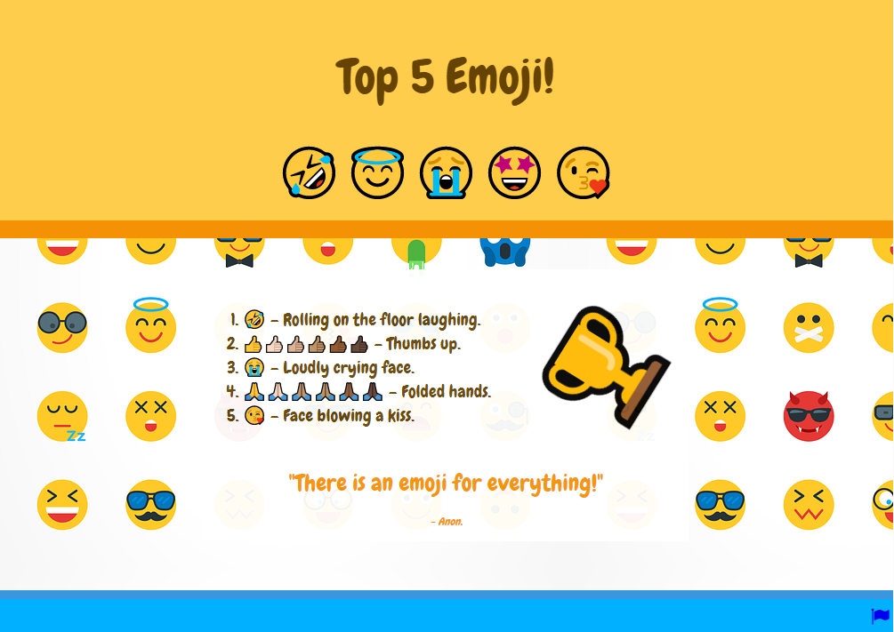

## Introduction

Dans ce projet, tu créeras une page web qui comprendra une liste du top 5 des emojis, quelques emojis animés et un arrière-plan d'emoji.

Les animations CSS sont utilisées pour attirer l'attention des gens et rendre un site web attrayant sans ralentir le chargement des pages. Les animations fonctionnent en modifiant une ou plusieurs propriétés d'un élément au cours d'une période donnée. Les exemples d'animations sont les effets de survol, le chargement d'images, l'animation de texte, les effets de particules et les images animées.

Tu vas :

- Utiliser des **listes**, des **block quotes** et des **liens** en HTML
- Utiliser les **animations** CSS pour attirer l'attention des gens sur ta page
- Créer ta propre **classe CSS** qui rend les éléments transparents pour que tu puisses voir une image d'arrière-plan

Un **rédacteur de contenu** ou un auteur de contenu recherche et écrit des articles intéressants pour un site web. Les listes des 5 ou 10 premiers sont populaires auprès de nombreuses personnes. Sur quoi ferais-tu une liste ?

--- no-print ---

--- task ---

### Essaie-le

  
Regarde les animations sur cette page web. À quelle fréquence se répètent-elles ? Peux-tu repérer un(e) :

- Liste
- Citation
- Lien

**Astuce :** appuie sur le bouton Run pour rejouer les animations.

<iframe src="https://editor.raspberrypi.org/fr-FR/embed/viewer/top-5-emoji-list-complete" width="500" height="700" frameborder="0" marginwidth="0" marginheight="0" allowfullscreen> </iframe>

--- /task ---
--- /no-print ---

--- print-only ---

--- /print-only ---
