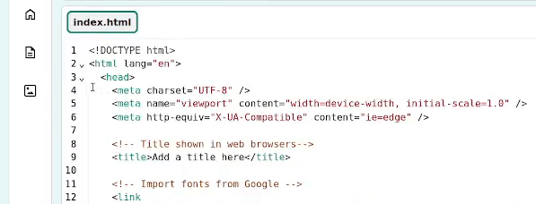

## Créer une liste sur le top 5

Dans cette étape, crée une liste ordonnée du top 5 pour montrer les emojis les plus utilisés.

<iframe src="https://editor.raspberrypi.org/fr-FR/embed/viewer/top-5-emoji-list-step-2" width="500" height="400" frameborder="0" marginwidth="0" marginheight="0" allowfullscreen> </iframe>

--- task ---

Ouvre le [projet de démarrage](https://editor.raspberrypi.org/fr-FR/projects/top-5-emoji-list-starter){:target="_blank"}.

--- /task ---

--- task ---

Réduis la section `<head>` pour rendre ton code plus facile à lire.

--- /task ---

--- task ---

**Regarder :** consulte le code `<header>`.

Note que les classes CSS permettant de styliser l'en-tête ont déjà été ajoutées pour toi. Celles-ci définissent les couleurs secondaires et la bordure inférieure, comme dans le projet [Expressions d'anime](https://projects.raspberrypi.org/fr/projects/anime-expressions){:target="_blank"}.

--- code ---
---
language: html
filename: index.html
line_numbers: true
line_number_start: 30
line_highlights: 30
---
  <header class="secondary border-bottom">

  </header>

--- /code ---

--- /task ---

--- task ---

Ajoute un en-tête `<h1>` avec le contenu `Top 5 des emojis !`.

--- code ---
---
language: html
filename: index.html
line_numbers: true
line_number_start: 30
line_highlights: 31
---
  <header class="secondary border-bottom">
    <h1>Top 5 des emojis !</h1>

--- /code ---

--- /task ---

--- task ---

Dans tes balises `<main>`, ajoute des balises `<section>` pour ta liste du top 5 des emojis. N'oublie pas de laisser une ligne vide entre les balises `<section>` pour te donner de la place pour ajouter plus de contenu.

--- code ---
---
language: html
filename: index.html
line_numbers: true
line_number_start: 34
line_highlights: 35-37
---
    <main>
      <section>
       
      </section>

    </main>

--- /code ---

--- /task ---

Les listes sont un excellent moyen d'afficher des informations sur une page web.

Il y a deux types de listes :

- Une **liste non ordonnée** `<ul>` : chaque nouvel élément commence par une puce. Une liste non ordonnée pourrait être des ingrédients sur une liste de courses ou une collection de tes couleurs préférées.
- Une **liste ordonnée** `<ol>` : chaque nouvel élément est numéroté et l'ordre dans lequel il est écrit est important. Tu peux utiliser une liste ordonnée pour une liste des dix meilleures chansons ou un classement sportif.

Une liste contient plusieurs éléments de liste `<li>`.

--- task ---

Dans tes balises `<section>`, ajoute les balises `<ol>` pour créer une liste ordonnée.

--- code ---
---
language: html
filename: index.html
line_numbers: true
line_number_start: 34
line_highlights: 36-38
---
    <main>
      <section>
        <ol>

        </ol>
      </section>

    </main>

--- /code ---

--- /task ---

--- task ---

Dans tes balises `<ol>`, ajoute une balise `<li>` pour ton premier élément de liste. Cela inclut l'emoji 'se rouler par terre' 🤣. Pour obtenir l'icône emoji, tu peux la **copier et coller** ci-dessous ou utiliser le clavier emoji.

--- collapse ---
---
title: Utiliser le clavier emoji
---

Les raccourcis clavier peuvent être utilisés pour accéder au clavier emoji sur ton ordinateur. Tu trouveras ci-dessous les raccourcis clavier courants :

**Windows**

Sélectionne Windows et appuie sur le point '.' (point ) en même temps.

**Linux**

Sélectionne Ctrl + Alt + E ensemble.

**Mac**

Sélectionne CTRL + CMD + Espace ensemble.

--- /collapse ---

--- code ---
---
language: html
filename: index.html
line_numbers: true
line_number_start: 34
line_highlights: 37
---
    <main>
      <section>
        <ol>
          <li>🤣 – Se rouler par terre en riant.</li>
        </ol>
      </section>

    </main>

--- /code ---

Tes emojis seront différents selon les systèmes d'exploitation.

--- /task ---

--- task ---

Ajoute le code pour les éléments restants de la liste `<li>`.

👍👍🏻👍🏼👍🏽👍🏾👍🏿 Certains emojis, par exemple, pouce levé et mains jointes, ont le choix entre plusieurs couleurs de peau. Tu peux en ajouter une ou inclure toutes les options dans ta liste.

--- code ---
---
language: html
filename: index.html
line_numbers: true
line_number_start: 34
line_highlights: 38-41
---
    <main>
      <section>
        <ol>
          <li>🤣 – Se rouler par terre en riant.</li>
          <li>👍👍🏻👍🏼👍🏽👍🏾👍🏿 – Pouce vers le haut.</li>
          <li>😭 – Visage qui pleure à chaudes larmes.</li>
          <li>🙏🙏🏻🙏🏽🙏🏽🙏🏾🙏🏿 – Mains jointes.</li>
          <li>😘 – Visage envoyant un baiser.</li>
        </ol>
      </section>

    </main>

--- /code ---

--- /task ---

--- task ---

**Test :** clique sur le bouton **Run**.

Vérifie que ta sortie affiche une liste numérotée. Le navigateur web insère les numéros pour toi afin qu'il soit facile d'ajouter et de supprimer des éléments de liste.

**Astuce :** si ton ordinateur ne supporte pas les emojis, alors tu peux les créer à partir de caractères, tels que **;)**.

<iframe src="https://editor.raspberrypi.org/fr-FR/embed/viewer/top-5-emoji-list-step-2" width="600" height="600" frameborder="0" marginwidth="0" marginheight="0" allowfullscreen> </iframe>

--- /task ---
