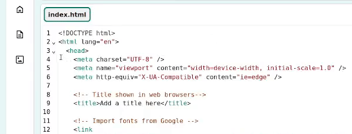

## Maak een top 5-lijst

Maak in deze stap een top 5 geordende lijst om de meest gebruikte emoji's weer te geven.

<iframe src="https://editor.raspberrypi.org/nl-NL/embed/viewer/top-5-emoji-list-step-2" width="500" height="400" frameborder="0" marginwidth="0" marginheight="0" allowfullscreen> </iframe>

--- task ---

Open het [startproject](https://editor.raspberrypi.org/nl-NL/projects/top-5-emoji-list-starter){:target="_blank"}.

--- /task ---

--- task ---

Klap de `<head>` sectie in om jouw code leesbaarder te maken.

--- /task ---

--- task ---

**Kijk:** Bekijk de `<header>` code.

Merk op dat de CSS classes om de header op te maken al voor je zijn toegevoegd. Deze stellen de secundaire kleuren en de onderste rand in, net als in het [Anime expressies](https://projects.raspberrypi.org/nl-NL/projects/anime-expressions){:target="_blank"} project.

--- code ---
---
language: html
filename: index.html
line_numbers: true
line_number_start: 30
line_highlights: 30
---
  <header class="secondary border-bottom">

  </header>

--- /code ---

--- /task ---

--- task ---

Voeg een `<h1>` kop toe met de inhoud `Top 5 emoji's!`.

--- code ---
---
language: html
filename: index.html
line_numbers: true
line_number_start: 30
line_highlights: 31
---
  <header class="secondary border-bottom">
    <h1>Top 5 emoji's!</h1>

--- /code ---

--- /task ---

--- task ---

Voeg binnen je `<main>`-tags `<section>`-tags toe voor je top 5 emoji-lijst. Vergeet niet om een lege regel te laten tussen de `<section>`-tags om je ruimte te geven om meer inhoud toe te voegen.

--- code ---
---
language: html
filename: index.html
line_numbers: true
line_number_start: 34
line_highlights: 35-37
---
    <main>
      <section>
       
      </section>

    </main>

--- /code ---

--- /task ---

Lijsten zijn een geweldige manier om informatie op een webpagina weer te geven.

Er zijn twee soorten lijsten:

- Een **ongeordende lijst** `<ul>`: elk nieuw item begint met een opsommingsteken. Een ongeordende lijst kan bestaan uit ingrediënten op een boodschappenlijstje of een verzameling van je favoriete kleuren.
- Een **geordende lijst** `<ol>`: elk nieuw item is genummerd en de opgegeven volgorde is belangrijk. Je zou een geordende lijst kunnen gebruiken voor een top tien van liedjes of een sportcompetitie tabel.

Een lijst bevat meerdere lijstitems `<li>`.

--- task ---

Binnen je `<section>` tags, voeg `<ol>` tags toe om een geordende lijst te maken.

--- code ---
---
language: html
filename: index.html
line_numbers: true
line_number_start: 34
line_highlights: 36-38
---
    <main>
      <section>
        <ol>

        </ol>
      </section>

    </main>

--- /code ---

--- /task ---

--- task ---

Binnen je `<ol>` tags, voeg een `<li>` tag toe voor je eerste lijst item. Dit bevat de `rollen op de vloer emoji` 🤣. Om het emoji-pictogram te krijgen, kun je het van hieronder **kopiëren en plakken** of het emoji-toetsenbord gebruiken.

--- collapse ---
---
title: Gebruik het emoji-toetsenbord
---

Toetsenbordsnelkoppelingen kunnen worden gebruikt om toegang te krijgen tot het emoji-toetsenbord op je computer. Hieronder staan veel voorkomende sneltoetsen:

**Windows**

Selecteer Windows en druk tegelijkertijd op de punt '.'.

**Linux**

Selecteer Ctrl + Alt + E samen.

**Mac**

Selecteer CTRL + CMD + spatie samen.

--- /collapse ---

--- code ---
---
language: html
filename: index.html
line_numbers: true
line_number_start: 34
line_highlights: 37
---
    <main>
      <section>
        <ol>
          <li>🤣 – Rollend over de vloer van het lachen.</li>
        </ol>
      </section>

    </main>

--- /code ---

Je emoji's zullen er op verschillende besturingssystemen anders uitzien.

--- /task ---

--- task ---

Voeg de code toe voor de resterende lijst items `<li>`.

👍👍🏻👍🏼👍🏽👍🏾👍🏿 Sommige emoji's, bijvoorbeeld duimen omhoog en gevouwen handen, hebben meerdere huidtinten om uit te kiezen. Je kunt één toevoegen of alle opties in jouw lijst weergeven.

--- code ---
---
language: html
filename: index.html
line_numbers: true
line_number_start: 34
line_highlights: 38-41
---
    <main>
      <section>
        <ol>
          <li>🤣 – Rollend over de vloer van het lachen.</li>
          <li>👍👍🏻👍🏼👍🏽👍🏾👍🏿 – Goed zo.</li>
          <li>😭 – Gezicht dat hard huilt.</li>
          <li>🙏🙏🏻🙏🏽🙏🏽🙏🏾🙏🏿 – Gevouwen handen.</li>
          <li>😘 – Gezicht dat zoen geeft.</li>
        </ol>
      </section>

    </main>

--- /code ---

--- /task ---

--- task ---

**Test:** Klik op de **Run** knop.

Controleer of je uitvoer een genummerde lijst toont. De webbrowser voegt de nummers voor jou in zodat het makkelijk is om lijsten met items toe te voegen en te verwijderen.

**Tip:** Als je computer geen emojis ondersteunt, kun je ze maken uit figuren, zoals **;)**.

<iframe src="https://editor.raspberrypi.org/nl-NL/embed/viewer/top-5-emoji-list-step-2" width="600" height="600" frameborder="0" marginwidth="0" marginheight="0" allowfullscreen> </iframe>

--- /task ---
