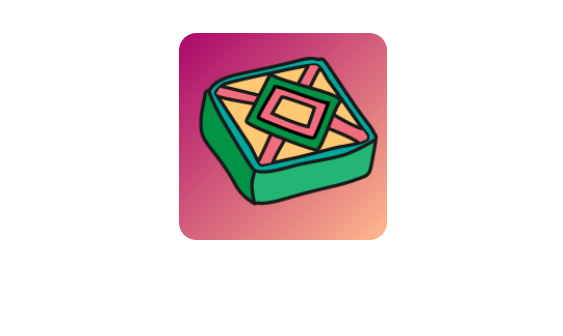

## Wat kun je verder nog doen?

Als je het pad [Introductie tot het web](https://projects.raspberrypi.org/nl/pathways/web-intro) volgt, kun je doorgaan naar het [Flip webcards met lekkernijen](https://projects.raspberrypi.org/nl-NL/projects/flip-treat-webcards) project. In dit project maak je een webpagina met flipkaarten met een afbeelding van een lekkernij op de voorkant en informatie over de lekkernij op de achterkant.

--- print-only ---

--- /print-only ---

--- no-print ---

### Probeer het uit

  
Beweeg over de kaart op deze pagina om te zien wat er gebeurt!

<iframe src="https://editor.raspberrypi.org/nl-NL/embed/viewer/flip-treat-webcards-step-5" width="550" height="400" frameborder="0" marginwidth="0" marginheight="0" allowfullscreen> </iframe>

--- /no-print ---

***

Dit project werd vertaald door vrijwilligers:

Iny van Beuningen
Robert-Jan Kempenaar

Dankzij vrijwilligers kunnen we mensen over de hele wereld de kans geven om in hun eigen taal te leren. Jij kunt ons helpen meer mensen te bereiken door vrijwillig te starten met vertalen - meer informatie op [rpf.io/translate](https://rpf.io/translate).
