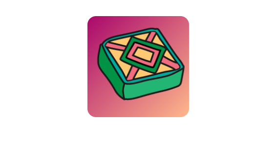

## Що далі?

Якщо ти йдеш напрямом [Вступ до веброзробки](https://projects.raspberrypi.org/uk-UA/pathways/web-intro), можеш переходити до наступного проєкту — [Двосторонні картки зі смаколиками](https://projects.raspberrypi.org/uk-UA/projects/flip-treat-webcards). У цьому проєкті ти створиш вебсторінку, куди додаси двосторонні картки із зображенням ласощів на одній стороні та інформацією про них на іншій.

--- print-only ---

--- /print-only ---

--- no-print ---

### Спробуй

  
Наведи курсор на картку на цій сторінці й подивися, що станеться!

<iframe src="https://editor.raspberrypi.org/uk-UA/embed/viewer/flip-treat-webcards-step-5" width="550" height="400" frameborder="0" marginwidth="0" marginheight="0" allowfullscreen> </iframe>

--- /no-print ---

***
"Цей проєкт переклали волонтери.

Завдяки волонтерам ми надаємо можливість людям у всьому світі навчатися рідною мовою. Ви також можете допомогти нам у цьому — більше інформації про волонтерську програму на [rpf.io/translate](https://rpf.io/translate).
